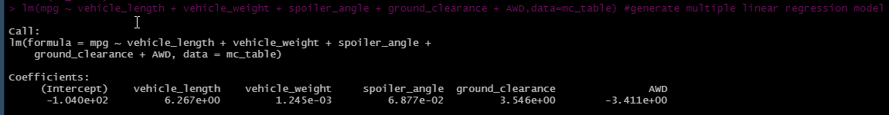
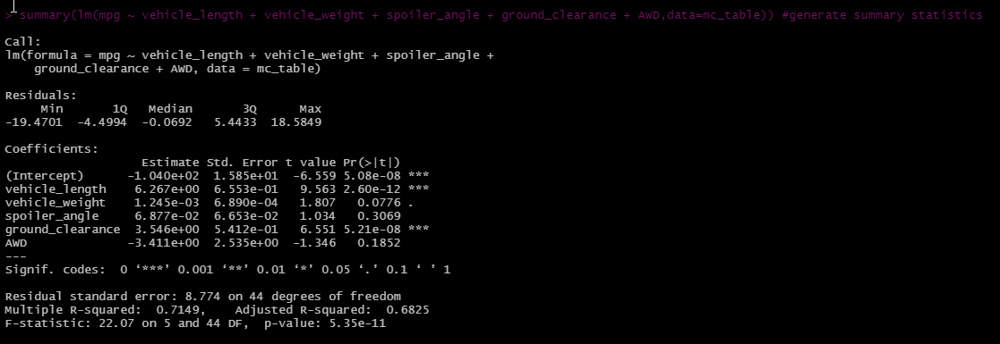
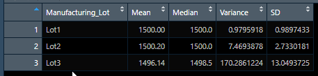
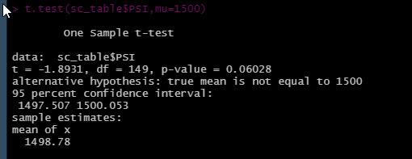
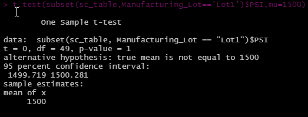
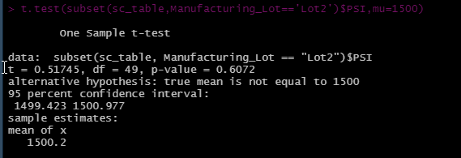
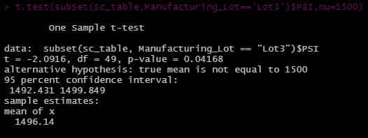

# MechaCar Statistical Analysis

## Overview
 AutosRUs’ newest prototype, the MechaCar, is suffering from production troubles that are blocking the manufacturing team’s progress. AutosRUs’ upper management wants the data analytics team to review the production data for insights that may help the manufacturing team.

### Purpose
The purpose of this project is to:
* Perform multiple linear regression analysis to identify which variables in the dataset predict the mpg of MechaCar prototypes
* Collect summary statistics on the pounds per square inch (PSI) of the suspension coils from the manufacturing lots
* Run t-tests to determine if the manufacturing lots are statistically different from the mean population
* Design a statistical study to compare vehicle performance of the MechaCar vehicles against vehicles from other manufacturers. For each statistical analysis, you’ll write a summary interpretation of the findings.

## Analysis

Data Source: 
* [MechaCar MPG Data Set](Resources/MechaCar_mpg.csv)
* [MechaCar Suspension Coil Data Set](Resources/Suspension_Coil.csv)

Software used: R, R dplyr library, RStudio

Analysis Code: [MechaCar Challenge](MechaCarChallenge.R)

## Results

### **Linear Regression to Predict MPG**
[//]: # (The MechaCar_mpg.csv dataset contains mpg test results for 50 prototype MechaCars. The MechaCar prototypes were produced using multiple design specifications to identify ideal vehicle performance. Multiple metrics, such as vehicle length, vehicle weight, spoiler angle, drivetrain, and ground clearance, were collected for each vehicle.)

Below is a linear model that predicts the mpg of MechaCar prototypes using several variables.

[//]: # ( Which variables/coefficients provided a non-random amount of variance to the mpg values in the dataset?)

* Vehicle length and ground clearance of the vehicle provide a non random amount of variance to the mpg values in the dataset. Although AWD data set shows strong negative correlation, the data set is a dichotomous and can be disregarded since it does not fit the assumptions to use linear regression. 

[//]: # ( Is the slope of the linear model considered to be zero? Why or why not?)

* The slope of the linear model is not considered to be zero because there are multiple variable that are showing correlation to the mpg of the vehicle. 

[//]: # ( Does this linear model predict mpg of MechaCar prototypes effectively? Why or why not?)

* The determining coefficien (R-squared value) for this model is 0.71. Considering R-squared value of 1 is a perfect fit, this model has some variability since its r-squared value is less than 1. There is some data that cannot be explained by this model. 

### **Summary Statistics on Suspension Coils**
[//]: # (The MechaCar Suspension_Coil.csv dataset contains the results from multiple production lots. In this dataset, the weight capacities of multiple suspension coils were tested to determine if the manufacturing process is consistent across production lots.)

The suspension coil’s PSI continuous variable across all manufacturing lots.

The following PSI metrics for each lot: mean, median, variance, and standard deviation.

[//]: # (The design specifications for the MechaCar suspension coils dictate that the variance of the suspension coils must not exceed 100 pounds per square inch. Does the current manufacturing data meet this design specification for all manufacturing lots in total and each lot individually? Why or why not?)

The current manufacturing data does not meet this design specification. The lot 3 variance exceeds the specified 100 pounds per square inch variance. 

### **T-Tests on Suspension Coils**
[//]: # (Briefly summarize your interpretation and findings for the t-test results. Include screenshots of the t-test to support your summary.)

The mean for PSI for the entire population is 1,500 pounds per square inch. 

OVERALL

Assuming our significance level was the common 0.05 percent, our p-value is slightly above our significance level. Therefore, we do not have sufficient evidence to reject the null hypothesis, and we would state that the two sample mean is statistically similar to the population mean. 

LOT 1:

The p-value for lot 1 is well above our significance level. Therefore, we do not have sufficient evidence to reject the null hypothesis, and we would state that the population mean and lot 1 mean are statistically similar.

[//]: # (there is no overall difference in fuel efficiency between vehicles manufactured in 1999 versus 2008.)

LOT 2:

The p-value for lot 2 is well above our significance level. Therefore, we do not have sufficient evidence to reject the null hypothesis, and we would state that the population mean and lot 2 mean are statistically similar.

LOT 3:

The p-value for lot 3 is below the assumed significance level of 0.05. Therefore, the null hypothesis can be rejected, and we would state that the population mean and lot 3 mean are not statistically similar.

## Summary
A statistical study to compare performance of the MechaCar vehicles against performance of vehicles from other manufacturers.

### Study Design: MechaCar vs Competition

[//]:# (Write a short description of a statistical study that can quantify how the MechaCar performs against the competition. In your study design, think critically about what metrics would be of interest to a consumer: for a few examples, cost, city or highway fuel efficiency, horse power, maintenance cost, or safety rating.)

METRIC TO MEASURE

As a consumer, city fuel efficiency is of high interest. The companies in competition have been striving to bring diesel like fuel efficiency to gasoline engines. MechaCar is going to have to join the race for fuel efficiency. To determine how MechaCar performs against competition, we can determine if a correlation exists between the type of automatic transmission and fuel efficiency. 

HYPOTHESES

    * NULL Hypothesis: The mean of fuel efficiencies for the different types of automatic transmission is the same across all types. 

    * ALTERNATIVE Hypothesis: The mean of fuel efficiencies for the different types of automatic transmission is not the same across all types. 

STATISTICAL TEST 

A one-way ANOVA is used to test the means of a single continuous dependent variable across a single independent variable with multiple groups, as in categorical data. In this case, our independent variable is the type of automatic transmission, which is catergorical data type and our dependent variable is fuel efficiency, which is a numerical and continuous data type.

DATA REQUIRED

Data needed to run this test calls for a data on cars with different types of automatic transmission engines. 

Ideally, other factors that change fuel efficiency should be avoided. However, since its not a perfect world, many more comparisons and statistical tests can be performed to determine the "sweet spot" on which type of transmission delievers the best fuel efficiency with various factors involved such as vehicle weight, vehicle type, ground clearance, drive type etc. 

